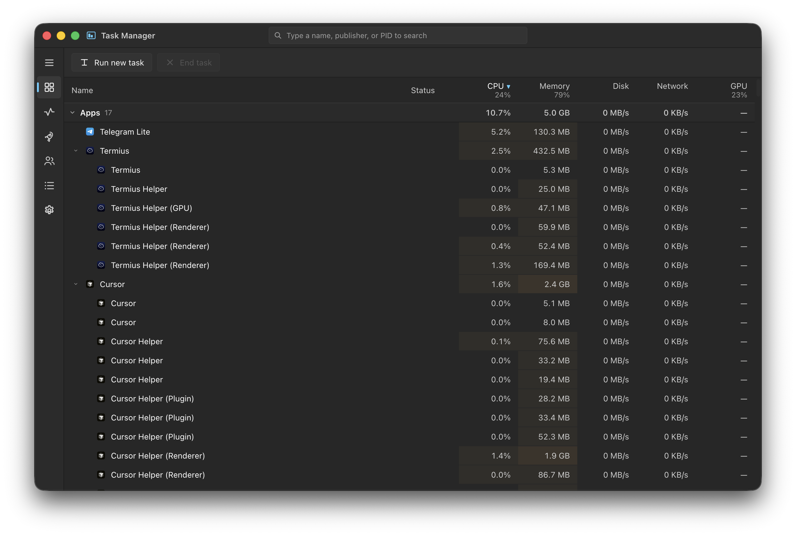
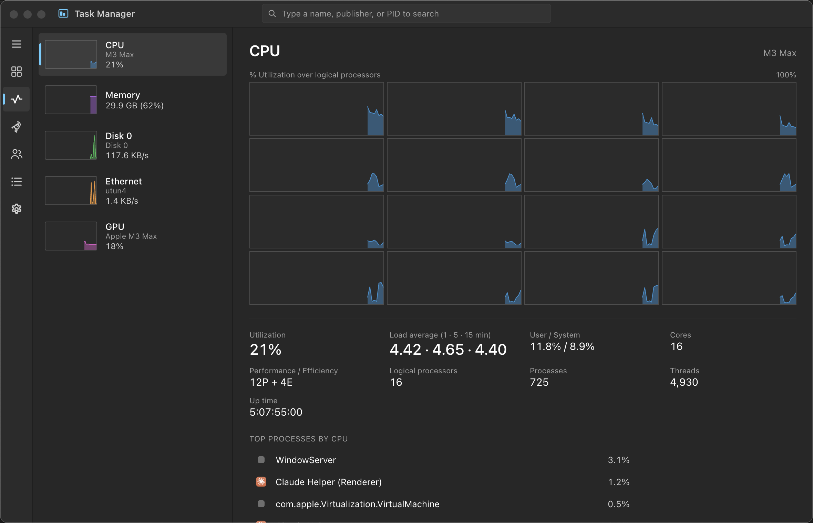
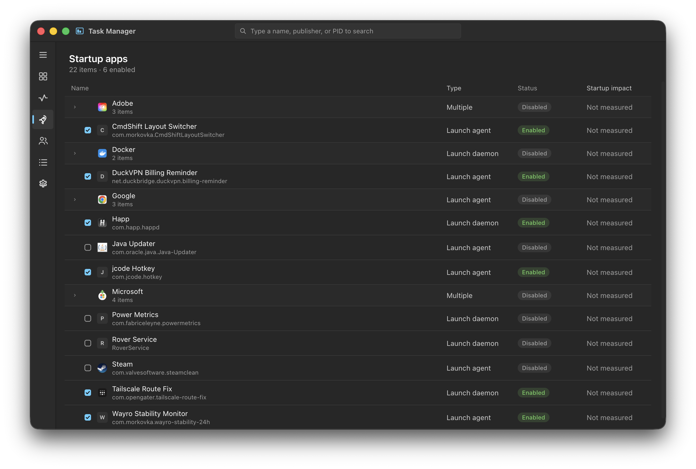

<div align="center">


# Task Manager for macOS

**A Windows‑style Task Manager for macOS — fast, dense, and it shows what you actually want to see.**

[](#)
[](#)
[](#)
[](#-license)

English · [Русский](README-RU.md)

</div>

---

Activity Monitor is fine, but it never quite scratched the itch — so this is the Task Manager
I wanted on my Mac. Processes in a tight, sortable table grouped into **Apps / Background /
System**, live **CPU · Memory · Disk · Network · GPU** columns, and a Performance tab with
per‑core graphs. The window is fully native macOS (real traffic lights), the layout is
borrowed from Windows 11.

<div align="center">
  
</div>

## ✨ Features

- 🗂 **Processes** — grouped into Apps / Background / System, then nested by app / same
  name (Chrome helpers stay under Chrome). Real app icons, aggregated CPU/Memory/Network,
  sortable columns, search, and a right‑click menu (End task, Set priority, Reveal in Finder).
- 📈 **Performance** — live graphs for CPU (a grid per logical core), Memory, Disk, Network
  and GPU, a “Top processes” list, and the details that matter: load average, P/E cores,
  swap, cached memory, uptime, threads…
- 🧠 **Memory done right** — reads `vm_stat`/`sysctl` to match Activity Monitor exactly
  (App + Wired + Compressed, plus swap and cached files) — something most libraries get
  wrong on macOS.
- 🌐 **Real disk & network rates** — derived from the system counters; per‑process network
  via `nettop`.
- 🎮 **GPU utilization on Apple Silicon** — pulled from `ioreg`, no `sudo`.
- 🚀 **Startup apps** — Launch Agents / Daemons with friendly names, app icons, and
  vendor groups (Adobe, Google, Docker…), plus on/off toggles.
- 👥 **Users · Details · Services** tabs, and a **Run new task** launcher.

## 📸 Screenshots

| Performance (per‑core) | Startup apps |
| :---: | :---: |
|  |  |

## 🚀 Getting started

You'll need [Node.js](https://nodejs.org/) 18+ and macOS 12 or newer.

**Run from source**

```bash
git clone https://github.com/tnAnGel/Task-Manager-for-macOS.git
cd TaskManager
npm install
npm start
```

**Build a `.dmg`** — the script auto‑detects your Mac's architecture:

```bash
./scripts/build.sh
```

…or pick a target yourself:

```bash
npm run dist:arm64      # Apple Silicon
npm run dist:x64        # Intel
npm run dist:universal  # one app for both
```

The installer lands in `dist/`. The app isn't code‑signed, so on first launch either
right‑click it → **Open**, or run:

```bash
xattr -dr com.apple.quarantine "/Applications/Task Manager.app"
```

> **Heads up:** Electron downloads its runtime from GitHub during `npm install`. If you use a
> DNS‑level blocker (AdGuard, Pi‑hole, a VPN…), allow `github.com` and
> `objects.githubusercontent.com`, or pause it for the install. If you can't unblock GitHub,
> use a mirror:
> ```bash
> ELECTRON_MIRROR="https://npmmirror.com/mirrors/electron/" npm install
> ```

## ⚠️ Notes & limitations

A few things macOS just doesn't expose the way Windows does:

- **Per‑process disk I/O** needs elevated tools, so that column stays at `0`.
- **Per‑process GPU** isn't available — the GPU figure is system‑wide.
- Ending or re‑prioritizing processes you don't own (or system ones) needs privileges and may
  quietly fail. Toggling a system Launch Daemon asks for your admin password.

## 🗂 Project structure

<details>
<summary>Click to expand</summary>

```
src/
  main/                 Electron main process
    main.js             window + app lifecycle + menu
    ipc.js              IPC handlers
    preload.js          window.api bridge
    actions.js          kill / priority / startup toggles / run task / app icons
    metrics/
      processes.js      process list (+ per-process network)
      system.js         CPU / memory / disk / net / GPU stats
  renderer/             UI (vanilla JS, no framework)
    index.html
    styles/             design tokens + per-area CSS
    js/
      app.js            bootstrap, sidebar, polling loop
      state.js          shared store
      format.js         number/byte formatting
      icons.js          lazy app-icon loader
      components/       sparkline, line chart, context menu, titlebar
      views/            processes, performance, details, startup, users, services
assets/                 app icon
image/                  screenshots for this README
scripts/build.sh        build helper
```

</details>

## 🛠 Built with

Electron and plain JS/HTML/CSS — no front‑end framework, no bundler. System data comes from
[`systeminformation`](https://systeminformation.io/) plus a few native macOS tools
(`vm_stat`, `ioreg`, `nettop`, `launchctl`).

## 📄 License

[MIT](LICENSE) — do whatever you like.
